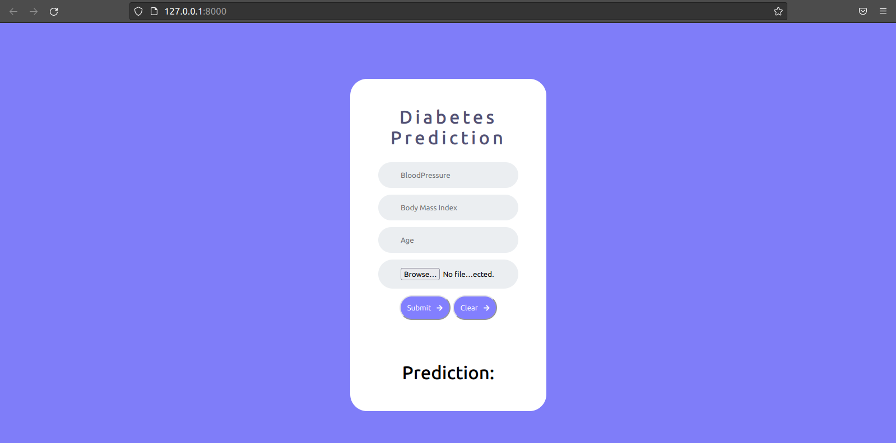

# Diabetes  Prediction

## Objective

Original dataset    :  https://archive.ics.uci.edu/ml/datasets/diabetes

Kaggle Competitions :  https://www.kaggle.com/uciml/pima-indians-diabetes-database

## Overview
This dataset is originally from the National Institute of Diabetes and Digestive and Kidney Diseases. The objective of the dataset is to diagnostically predict whether or not a patient has diabetes, based on certain diagnostic measurements included in the dataset. Several constraints were placed on the selection of these instances from a larger database.

### Techniques Used

- Data Cleaning
- Data Visualization
- Machine Learning Modeling

### Algortihms Used

1. Logistic Regression
2. KNN
3. Support Vector Machine
4. Random Forest Classifier
5. Decision Tree
6. XGboost

### Accuracy We got

1. Logistic Regression		: 77.92%
2. KNN						: 74.92%
3. Support Vector Machine	: 78.57%
4. Random Forest Classifier	: 80.52%
5. Decision Tree			: 79.22%
6. XGboost					: 75.32%


### Screenshot



## Installation
- Clone this repository and unzip it.

- After downloading, `cd` into the `Deployment` directory.

- Begin a new virtual environment with Python 3 and activate it.

- Install the required packages using 
   `pip install -r requirements.txt`

- Execute the command:
   `python manage.py runserver`

- Open http://127.0.0.1:8000/ in your browser.

- Upload the csv of PPG signal.

- Enter the physiological data.


## Guide Lines 

### Packages and Tools Required:
```
Pandas 
Matplotlib
Seaborn
Scikit Learn
Jupyter Notebook
Django
```
### Package Installation
```
pip3 install -r requirements.txt
```
